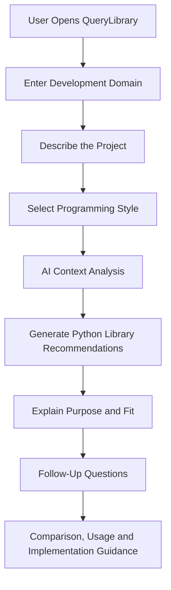
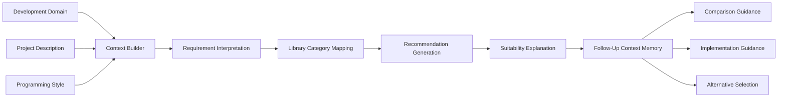

[ReadMe.md](https://github.com/user-attachments/files/29942924/ReadMe.md)
# QueryLibrary: AI Python Library Recommendation Agent
### *Context-Aware Python Ecosystem Discovery, Stack Selection and Developer Guidance*

<p align="center">
  <a href="https://partyrock.aws/u/arnavraj/YDr5fMt8o/QueryLibrary">
    
  </a>
  
  
  
  
</p>

<p align="center">
  <strong>Stop guessing packages. Describe the project, define the coding style, and let QueryLibrary map the right Python ecosystem for the build.</strong>
</p>

---

## Authorized Application Access

<p align="center">
  <a href="https://partyrock.aws/u/arnavraj/YDr5fMt8o/QueryLibrary">
    
  </a>
</p>

**Official hosted application:**  
https://partyrock.aws/u/arnavraj/YDr5fMt8o/QueryLibrary

> [!IMPORTANT]
> **Private and Proprietary Project:** QueryLibrary is an independently designed AI product owned by **Arnav Raj**. This repository is maintained for controlled documentation, portfolio review, recruiter evaluation, and authorized collaboration. The project is not open source. Access to the hosted application does not grant permission to copy, reproduce, redistribute, rebrand, reverse engineer, commercially exploit, or claim ownership of its concept, prompts, workflow, documentation, or branding.

---

## Overview

**QueryLibrary** is a specialized AI recommendation agent created to help developers identify Python libraries that actually fit their project instead of blindly choosing whatever package appears first in a search result.

The agent works from three practical signals:

1. **Development Domain**
2. **Project Description**
3. **Programming Style**

It analyzes the relationship between these inputs, generates a focused set of Python library recommendations, and continues the interaction through a follow-up assistant that helps the user understand usage, trade-offs, comparisons, implementation direction, and package suitability.

The goal is simple: turn an unclear Python package search into a structured technical decision.

---

## Why QueryLibrary Exists

Python has one of the strongest software ecosystems in the world, but that scale creates a real problem.

A developer may find ten libraries that appear to solve the same task, while each one differs in:

- Learning curve
- Maintenance maturity
- Performance
- Abstraction level
- Community support
- Deployment complexity
- External dependencies
- Compatibility
- Security exposure
- Suitability for prototypes or production systems

Search engines usually return popularity. Package indexes return metadata. Generic chatbots often return long lists.

**QueryLibrary is built to return fit.**

It does not only ask, "Which library is popular?"

It asks:

- What are you building?
- Which technical domain does it belong to?
- How do you prefer to write and structure code?
- Do you need speed, simplicity, modularity, async support, low dependencies, or production readiness?
- Which package combination makes sense as one stack?

---

## Core Value Proposition

| Traditional Discovery | QueryLibrary Approach |
|---|---|
| Search package names manually | Describe the actual project |
| Compare documentation across tabs | Receive one structured recommendation flow |
| Pick libraries mainly by popularity | Match packages to technical requirements |
| Ignore coding preferences | Consider the user's programming style |
| Receive isolated package names | Receive a connected project stack |
| Restart research for every question | Continue through a contextual follow-up assistant |

---

## What QueryLibrary Can Do

### 1. Domain-Aware Recommendations

The agent uses the development domain to narrow the Python ecosystem before producing suggestions.

Example domains include:

- Artificial Intelligence
- Machine Learning
- Data Science
- Backend Development
- API Engineering
- Cybersecurity
- Automation
- Natural Language Processing
- Computer Vision
- Web Scraping
- Testing
- Scientific Computing
- Database Applications
- Data Engineering
- Desktop Development

### 2. Project-Context Understanding

A package recommendation becomes useful only when it understands the build behind it.

QueryLibrary considers details such as:

- Project objective
- Input and output type
- Expected features
- Data volume
- User experience
- Security needs
- Performance expectations
- Deployment target
- Developer experience level
- Integration requirements

### 3. Programming-Style Alignment

The agent adapts recommendations based on how the developer wants to build.

Supported preference patterns can include:

- Beginner-friendly
- Minimal and lightweight
- Object-oriented
- Functional
- Asynchronous
- Modular
- Strongly typed
- Performance-focused
- Research-oriented
- Rapid prototyping
- Production-oriented
- Security-focused

### 4. Structured Library Selection

Instead of dropping a random list, the agent is designed to organize recommendations around practical roles such as:

- Core framework
- Data processing
- Validation
- Database access
- Machine learning
- Visualization
- Testing
- Security
- Deployment support
- Optional alternatives

### 5. Follow-Up Developer Assistant

After the first recommendation, the user can continue asking questions such as:

- Which option is easier for a beginner?
- Which library is faster?
- What are the trade-offs?
- Can these libraries work together?
- How should I install them?
- Which one is better for production?
- What should I use instead of this package?
- How do I start implementing the stack?
- Which dependencies are actually necessary?

### 6. Decision Support, Not Package Dumping

QueryLibrary aims to reduce dependency overload by prioritizing packages that directly support the project.

The agent is designed around a simple principle:

> Recommend what the project needs, not every package that could possibly be used.

---

## User Journey



---

## Agent Intelligence Flow



### Internal Decision Stages

#### Stage 1: Context Collection

The agent collects the minimum information required to understand the project direction.

#### Stage 2: Requirement Interpretation

The project idea is translated into technical needs such as API development, model training, visualization, storage, automation, validation, or testing.

#### Stage 3: Ecosystem Mapping

The interpreted needs are mapped to relevant Python package categories.

#### Stage 4: Recommendation Prioritization

Libraries are prioritized according to project relevance, coding style, complexity, and expected use.

#### Stage 5: Explanation

The agent explains why a library fits instead of returning only a package name.

#### Stage 6: Conversational Continuation

The follow-up assistant uses the generated recommendations as context for deeper questions.

---

## Application Components

| Component | Role |
|---|---|
| **Introduction** | Explains the purpose of QueryLibrary |
| **Development Domain** | Captures the technical area of the project |
| **Project Description** | Captures the problem, features, constraints, and intended output |
| **Programming Style** | Captures how the user prefers to build |
| **Library Recommendations** | Generates a contextual Python stack |
| **Follow-Up Questions** | Supports comparison, clarification, usage, and implementation guidance |

---

## Recommendation Framework

QueryLibrary evaluates recommendations through a practical decision model.

| Evaluation Signal | What It Means |
|---|---|
| **Relevance** | Does the package directly support the project requirement? |
| **Usability** | Can the intended developer realistically use it? |
| **Complexity Fit** | Is the package too heavy or too limited for the project? |
| **Programming Style Fit** | Does it match the preferred development approach? |
| **Integration Fit** | Can it work with the rest of the suggested stack? |
| **Scalability Fit** | Is it suitable for the expected project size? |
| **Maintenance Awareness** | Does the recommendation require external verification before adoption? |
| **Dependency Discipline** | Can unnecessary packages be avoided? |
| **Explainability** | Can the recommendation be justified clearly? |
| **Actionability** | Can the user move from recommendation to implementation? |

---

## Example Interaction

### User Input

```text
Development Domain:
Cybersecurity and backend development

Project Description:
I want to build an API that accepts security log files, detects suspicious IP behaviour,
stores alerts, and returns the analysis through REST endpoints.

Programming Style:
Modular, asynchronous, typed, production-oriented, and security-focused.
```

### Expected Recommendation Direction

```text
FastAPI
Role: API framework
Why it fits: Typed request validation, asynchronous endpoint support, and automatic API documentation.

Pydantic
Role: Data validation
Why it fits: Validates uploaded request structures, configuration values, and API responses.

SQLAlchemy
Role: Database layer
Why it fits: Provides mature database modelling and can support asynchronous PostgreSQL workflows.

Polars or Pandas
Role: Log analysis
Why it fits: Supports structured data processing, filtering, aggregation, and anomaly preparation.

Pytest
Role: Testing
Why it fits: Supports unit and API-level testing for the security analysis workflow.
```

### Follow-Up Questions

```text
Which is better for large logs, Pandas or Polars?

Can I use SQLAlchemy asynchronously with FastAPI?

Which packages are required and which ones are optional?

How should I organize the project folders?

What should I verify before using these packages in production?
```

---

## Recommended Input Format

For better recommendations, users should provide enough context.

### Development Domain

```text
Machine Learning and Computer Vision
```

### Project Description

```text
Build a tool that receives uploaded images, detects objects, stores prediction history,
generates confidence reports, and exposes the results through an API.
```

### Programming Style

```text
Modular, production-oriented, typed, and easy to maintain.
```

### Weak Input

```text
I want Python libraries for AI.
```

### Strong Input

```text
I want to build a FastAPI-based computer vision service that processes uploaded product
images, performs object detection, stores prediction records in PostgreSQL, and supports
Docker deployment. I prefer modular, typed, production-oriented Python.
```

The stronger input gives the agent enough information to separate the model layer, API layer, database layer, validation layer, and deployment requirements.

---

## Supported Project Patterns

QueryLibrary can support recommendation workflows for:

### AI and Machine Learning

- Model training
- Classification
- Regression
- NLP
- Computer vision
- Explainable AI
- Data preprocessing
- Evaluation

### Backend Engineering

- REST APIs
- Authentication workflows
- Database access
- Validation
- Async services
- Background tasks
- Testing

### Cybersecurity

- Log processing
- Network analysis
- OSINT automation
- Malware research support
- Threat-data processing
- Security dashboards
- Defensive scripting

### Data and Analytics

- Data cleaning
- Statistical analysis
- Time-series processing
- Visualization
- ETL pipelines
- Report generation

### Automation

- File processing
- Browser automation
- Task scheduling
- API integration
- System scripting
- Document workflows

### Developer Tooling

- CLI applications
- Code quality
- Testing
- Packaging
- Documentation
- Environment management

---

## Technology Foundation

| Layer | Technology |
|---|---|
| **Application Platform** | AWS PartyRock |
| **Generative AI Foundation** | Amazon Bedrock ecosystem |
| **Interaction Model** | Structured input and conversational follow-up |
| **Core Pattern** | Context-aware recommendation workflow |
| **Interface** | Browser-based AI application |
| **Deployment Access** | Official PartyRock application link |
| **Repository Model** | Private documentation and controlled project records |

QueryLibrary is implemented as a browser-based generative AI application using AWS PartyRock. Its workflow combines user-input widgets, generated recommendation output, and a follow-up conversational component.

---

## Design Principles

### Relevance First

Every recommendation should connect directly to the project.

### Explain the Choice

A package name without reasoning is not enough.

### Avoid Dependency Noise

More libraries do not automatically create a better stack.

### Match the Developer

The same project can require different recommendations for a beginner, researcher, performance engineer, or production developer.

### Keep Human Control

The user makes the final technical decision.

### Stay Honest About Uncertainty

Package versions, maintenance status, vulnerabilities, licensing, and compatibility must be verified from official sources before real adoption.

---

## Evaluation Strategy

QueryLibrary can be evaluated using controlled project prompts across multiple domains.

### Core Evaluation Metrics

| Metric | Success Condition |
|---|---|
| **Recommendation Relevance** | Suggested libraries directly match the project |
| **Hallucination Resistance** | No invented packages, APIs, or unsupported features |
| **Stack Coherence** | Recommended packages can logically work together |
| **Style Alignment** | Suggestions reflect the requested programming style |
| **Explanation Quality** | Each major choice has a clear reason |
| **Dependency Restraint** | The agent avoids unnecessary packages |
| **Follow-Up Consistency** | Later answers remain grounded in the original recommendation |
| **Practical Usefulness** | A developer can identify a realistic next step |
| **Limitation Awareness** | The agent does not present unverified claims as facts |

### Suggested Test Scenarios

- Beginner data-analysis project
- Production REST API
- Async backend
- Computer vision prototype
- Cybersecurity log analyzer
- Minimal-dependency automation script
- Research-focused machine learning pipeline
- Vague project description
- Conflicting requirements
- Request for an imaginary package
- Request involving a non-Python requirement
- Follow-up comparison between two recommended libraries

---

## Security, Privacy and Responsible Use

QueryLibrary is a recommendation assistant. It should not be treated as a package-security scanner or dependency approval system.

Users should never submit:

- API keys
- Passwords
- Access tokens
- Private source code
- Confidential architecture
- Personal data
- Proprietary datasets
- Internal security findings
- Unreleased commercial information

Before installing any recommended package, users should independently verify:

1. Official package name
2. Official documentation
3. PyPI publisher information
4. Source repository
5. Latest release activity
6. Supported Python versions
7. Operating-system compatibility
8. License
9. Known vulnerabilities
10. Transitive dependencies
11. Install scripts
12. Production suitability

---

## Intended Use

QueryLibrary is intended for:

- Python ecosystem discovery
- Developer education
- Early project planning
- Technology-stack comparison
- Prototype design
- Package research
- Student guidance
- Technical portfolio demonstration
- Prompt-engineering experimentation
- AI-assisted developer support

---

## Limitations

> [!NOTE]
> QueryLibrary supports technical decision-making. It does not replace official documentation, package maintainers, security review, legal review, architecture review, or production testing.

Current limitations include:

- It may generate incorrect or outdated package information.
- It does not automatically validate every recommendation against live PyPI data.
- It does not inspect package source code.
- It does not audit dependency trees.
- It does not scan for vulnerabilities.
- It does not verify licenses automatically.
- It does not install or execute packages.
- It does not test compatibility inside the user's environment.
- It does not inspect an existing codebase.
- It does not guarantee production readiness.
- Recommendation quality depends on input quality.
- Foundation-model behaviour may vary across prompts and sessions.

---

## What QueryLibrary Is Not

QueryLibrary is not:

- A package manager
- A vulnerability scanner
- A dependency lockfile generator
- A software-composition-analysis platform
- A code execution environment
- A source-code auditor
- A replacement for PyPI
- A replacement for official documentation
- A final production architecture authority

It is a focused AI decision-support layer for Python library discovery.

---

## Repository Purpose

This private repository is designed to maintain:

- Product documentation
- Architecture records
- Controlled screenshots
- Evaluation cases
- Prompt-version notes
- Feature planning
- Ownership records
- Private design decisions
- Authorized portfolio material

The implementation logic, production prompts, internal configuration, and controlled product assets may be intentionally excluded from repository-visible documentation.

---

## Private Repository Structure

```text
QueryLibrary/
├── README.md
├── LICENSE.md
├── docs/
│   ├── PRODUCT_OVERVIEW.md
│   ├── ARCHITECTURE.md
│   ├── EVALUATION.md
│   ├── RESPONSIBLE_AI.md
│   └── ROADMAP.md
├── assets/
│   ├── screenshots/
│   └── diagrams/
├── tests/
│   └── evaluation-prompts.md
└── private/
    ├── prompt-versions/
    ├── workflow-notes/
    └── product-decisions/
```

> The structure above represents the recommended private project organization. Sensitive prompt logic, access information, and proprietary files should remain private.

---

## Product Roadmap

### Recommendation Intelligence

- Live package-existence validation
- Package-category confidence scoring
- Alternative stack comparison
- Beginner, research, and production modes
- Project-size-aware recommendations
- Dependency-minimization mode

### Package Intelligence

- PyPI metadata retrieval
- Release-health indicators
- Python-version compatibility
- License visibility
- Vulnerability intelligence
- Repository activity signals
- Dependency-tree awareness

### Developer Experience

- Export to `requirements.txt`
- Export to `pyproject.toml`
- Starter project structure generation
- Installation-plan generation
- Code-example generation
- Side-by-side package comparison
- Saved recommendation history

### Trust and Evaluation

- Automated regression prompts
- Hallucination checks
- Recommendation-quality scoring
- Source-backed package verification
- Explainable selection criteria
- Safety and misuse testing

### Product Expansion

- Multi-language developer support
- JavaScript and TypeScript ecosystem mode
- Cybersecurity tool recommender
- AI model and framework recommender
- Cloud-service recommender
- Integrated project architecture planner

---

## Project Status

| Field | Current State |
|---|---|
| **Project Name** | QueryLibrary |
| **Project Type** | AI Python Library Recommendation Agent |
| **Stage** | Functional Prototype |
| **Platform** | AWS PartyRock |
| **Access** | Authorized hosted application |
| **Repository** | Private |
| **Source Availability** | Not open source |
| **License Model** | Proprietary, All Rights Reserved |
| **Primary Builder** | Arnav Raj |
| **Core Focus** | Context-aware developer decision support |

---

## Recruiter Snapshot

QueryLibrary demonstrates practical ability across:

- Generative AI application design
- Prompt architecture
- Context-aware recommendation systems
- Developer tooling
- Product thinking
- User-flow design
- Technical documentation
- Responsible AI positioning
- Requirement interpretation
- Human-in-the-loop decision support
- AWS PartyRock and Amazon Bedrock ecosystem exposure

The project reflects a builder mindset focused on making AI useful, structured, and understandable rather than adding AI for hype.

---

## Developer and Ownership

**Designed and developed by Arnav Raj**

AI/ML, Cybersecurity, AI Security and public-interest technology builder.

- **GitHub:** [@yocybroarnv](https://github.com/yocybroarnv)
- **LinkedIn:** [Arnav Raj](https://www.linkedin.com/in/arnav-raj-professional)
- **Handle:** `@suvam.arnavraj`
- **Official Application:** [QueryLibrary on AWS PartyRock](https://partyrock.aws/u/arnavraj/YDr5fMt8o/QueryLibrary)

---

## License and Ownership

```text
Copyright (c) 2026 Arnav Raj
All Rights Reserved.
```

QueryLibrary is a **private and proprietary project**.

Unless separate written permission is granted by the owner:

- No source code, prompt logic, workflow design, documentation, screenshots, branding, or product material may be copied.
- No part of the project may be redistributed, sublicensed, sold, republished, or commercially exploited.
- No derivative project may use the QueryLibrary name, identity, branding, or substantially reproduced documentation.
- No ownership rights are transferred by viewing this repository or accessing the hosted application.
- Recruiters and authorized reviewers may evaluate the project for portfolio, hiring, academic, or collaboration purposes.
- Any approved usage must also comply with the applicable AWS PartyRock and Amazon Web Services terms.

See [`LICENSE.md`](LICENSE.md) for the complete proprietary notice.

---

## Platform Attribution

QueryLibrary is an independent project created using **AWS PartyRock**, a generative AI application-building environment in the Amazon Bedrock ecosystem.

AWS, Amazon Bedrock, PartyRock, and related marks belong to Amazon Web Services, Inc. QueryLibrary is not an official AWS product, certification, endorsement, or partnership unless explicitly stated by AWS.

---

## Final Note

**QueryLibrary is not built to replace developer judgment. It is built to sharpen it.**

The agent turns project context into an explainable Python library direction, keeps the user in control, and reduces the noise between an idea and a workable technology stack.

<p align="center">
  <strong>Describe the build. Define the style. Discover the right Python stack.</strong>
</p>

<p align="center">
  <a href="https://partyrock.aws/u/arnavraj/YDr5fMt8o/QueryLibrary">
    
  </a>
</p>
